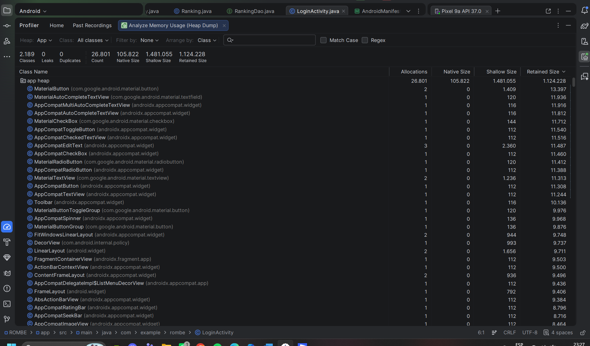
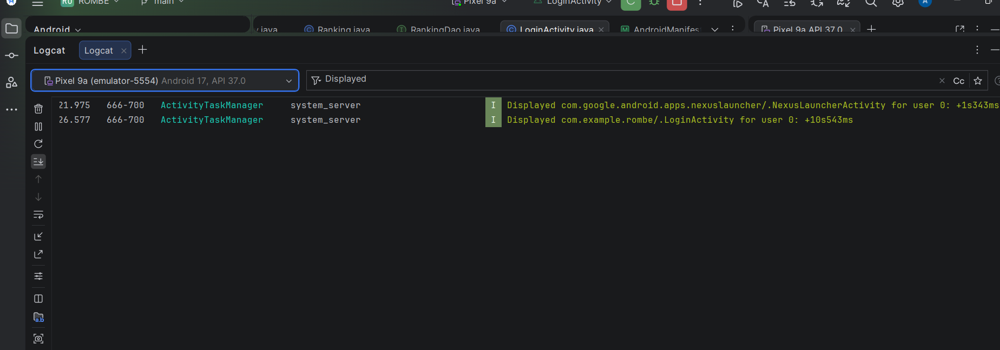
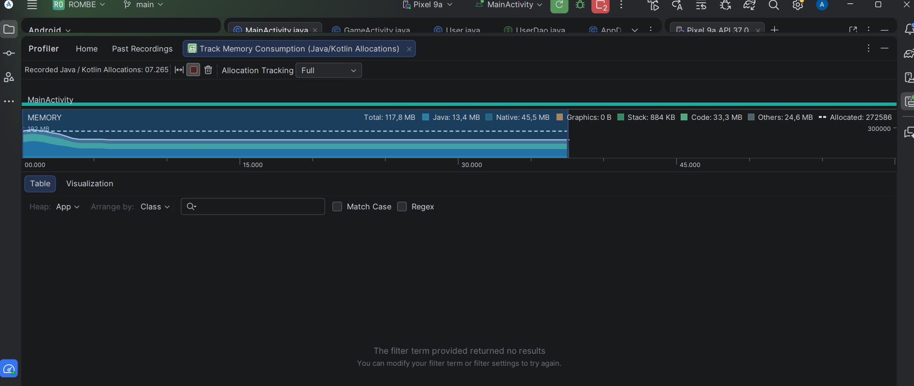

# 🟠 ROMBE — Rompe Bloques

## 📱 Descripción del problema que resuelve
Muchos juegos móviles interrumpen la experiencia con anuncios o pantallas innecesarias, generando frustración y pérdida de tiempo.  
ROMBE elimina esas barreras: no tiene anuncios, inicia de forma directa y ofrece mecánicas simples que garantizan entretenimiento rápido.

## 🎯 Objetivo de la aplicación
Desarrollar un juego ligero que permita iniciar partidas rápidas, romper bloques y acumular puntuaciones, fomentando la competencia amistosa y el entretenimiento casual.

## ✅ Historias de usuario del MVP
1. Como jugador quiero iniciar sesión para guardar mi progreso.  
2. Como jugador quiero empezar una partida rompiendo bloques.  
3. Como jugador quiero ver mi puntaje al terminar la partida.  
4. Como jugador quiero aparecer en un ranking para competir con otros.  
5. Como jugador quiero editar mi perfil para personalizar mi experiencia.  

## 🧰 Tecnología usada
- Android Studio  
- Lenguaje: Java  
- Gradle para la gestión de dependencias  
- Firebase Firestore para sincronización de datos  
- Room (SQLite) para almacenamiento local  
- Navigation Component para la navegación entre pantallas  

## 🏗️ Arquitectura
- MVVM (Modelo, Vista, ViewModel)  
- Room (SQLite) para almacenamiento local  
- Firebase Authentication y Firestore para login y datos  
- Navigation Component para flujo entre pantallas  

## ⚙️ Funcionalidades implementadas
- Login y registro de usuario  
- Validaciones de campos  
- CRUD completo de jugadores (crear, leer, actualizar, eliminar)  
- Ranking dinámico con RecyclerView  
- Perfil editable  
- Notificaciones locales  

## 📸 Capturas de la aplicación
  
  
  

---

## 🐞 Tabla de Bugs

| ID  | Fuente de detección | Descripción del bug                  | Severidad | Estado final | Causa raíz documentada |
|-----|---------------------|--------------------------------------|-----------|--------------|------------------------|
| B1  | Focus group         | Ranking se carga lento               | Media     | Corregido    | Adapter no inicializado en RankingActivity |
| B2  | Focus group         | Colores poco atractivos              | Baja      | Pendiente    | Uso de paleta por defecto en XML |
| B3  | Unitarias           | Validación de campo puntaje          | Alta      | Corregido    | Falta de condición en Validaciones.java |
| B4  | Integración         | Sincronización lenta con Firestore   | Media     | Pendiente    | Consulta sin índice en Firestore |
| B5  | UI                  | Botón "Editar perfil" no responde    | Media     | Corregido    | Listener mal referenciado en activity_edit_profile.xml |
| B6  | UI                  | Texto se corta en pantallas pequeñas | Baja      | Pendiente    | ConstraintLayout sin ajuste responsive |
| B7  | Logcat (Displayed)  | Tiempo de inicio ~10.5s              | Alta      | Pendiente    | Inicialización pesada en LoginActivity (carga simultánea de Firebase y Room) |
| B8  | Profiler (Memory)   | Consumo de memoria al navegar flujo  | Media     | Pendiente    | Posibles listeners no liberados en RankingActivity |

---

## 📸 Evidencias de Bugs

### Bug B3 — Validación de puntaje
**Antes:**  
  

**Después:**  
  

### Bug de rendimiento — Consumo de memoria (Heap Dump)
**Evidencia Profiler (Heap Dump):**  

- Fuente: Pruebas de rendimiento con Android Profiler  
- Descripción: Se detectó alto consumo de memoria en componentes de UI (`MaterialButton`, `LinearLayout`).  
- Severidad: Media  
- Estado: Pendiente  
- Causa raíz: Demasiadas instancias creadas sin reciclaje en la interfaz.

### Bug de rendimiento — Tiempo de inicio
**Evidencia Logcat (Displayed):**  

- Fuente: Logcat con filtro "Displayed"  
- Descripción: La aplicación tarda ~10.5 segundos en iniciar.  
- Severidad: Alta  
- Estado: Pendiente  
- Causa raíz: Inicialización pesada en LoginActivity (carga simultánea de Firebase y Room).

### Bug de rendimiento — Observación de memoria
**Evidencia Profiler (Memory):**  

- Fuente: Profiler en pestaña Memory  
- Descripción: Se observó el uso de memoria al navegar por todas las pantallas del MVP.  
- Resultado: La memoria se mantiene [estable / sube constantemente] según la gráfica.  
- Severidad: [Baja si estable / Media si hay fuga]  
- Estado: [Pendiente si no lo has corregido / Corregido si optimizaste]  
- Causa raíz: [Ejemplo: listeners no liberados en RankingActivity]

---

## 🧪 Evidencia de calidad y validación
- ✅ Pruebas unitarias en Android Studio: todas aprobadas.  
- 👥 Focus group: 100% completó login, satisfacción promedio 4.33/5.  
- 🐞 Tabla de bugs documentada con estados finales.  
- ⚡ Métrica de rendimiento: tiempo de respuesta < 200 ms en consultas.  

---

## 🤖 Reflexión sobre IA
- Herramientas usadas: **Perplexity** (investigación técnica), **Claude** (análisis de feedback).  
- Prompt más útil: *“Calcula el promedio por dimensión, identifica los problemas más mencionados y clasifica los bugs por severidad”*.  
  → Resultado: priorizamos qué bugs arreglar primero antes de la entrega, enfocándonos en los críticos y dejando los detalles visuales para después.  
- Caso de error: Claude clasificó como bug un cambio de color que era solo estético.  
- Cierre: *“Si empezáramos de nuevo, integraríamos IA desde la fase de diseño para acelerar aún más el desarrollo y evitar errores de interpretación.”*  

---

## 📝 Historial de commits
- feat: implementar entidad Jugador con Room  
- feat: agregar formulario de creación de jugador  
- feat: mostrar lista de jugadores en RecyclerView  
- fix: inicializar adapter en RankingActivity para mejorar carga del ranking  
- fix: agregar condición de validación en Validaciones.java  
- fix: corregir listener en botón Editar perfil en activity_edit_profile.xml  
- docs: actualizar README con arquitectura y capturas  

---

## 🚀 Estado del proyecto
El proyecto se encuentra en versión MVP con funcionalidades CRUD completas, ranking dinámico y notificaciones locales programadas.

## 📎 Repositorio
[ROMBE en GitHub](https://github.com/AbigailAlmachi/Rombe)
